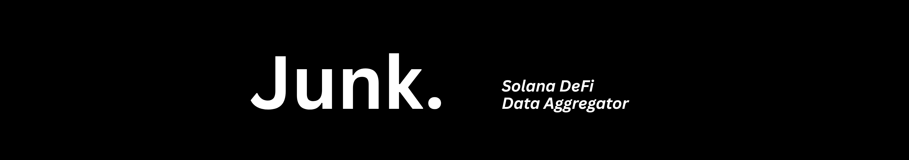

 

> It's called _"Junkyard"_ because that's essentially what it is: a scrapyard of data aggregated from various DeFi protocols on Solana.

**Check out [docs.junkyard.cloud](https://docs.junkyard.cloud/)**

Found a bug or want to contribute? Open an [issue here](https://github.com/eesuhn/junkyard/issues/new).

[![Buy Me A Coffee][coffee]](https://buymeacoffee.com/eesuhn)
[coffee]: https://img.shields.io/badge/Buy%20Me%20A%20Coffee-FF813F?style=for-the-badge&logo=buy-me-a-coffee&logoColor=white
